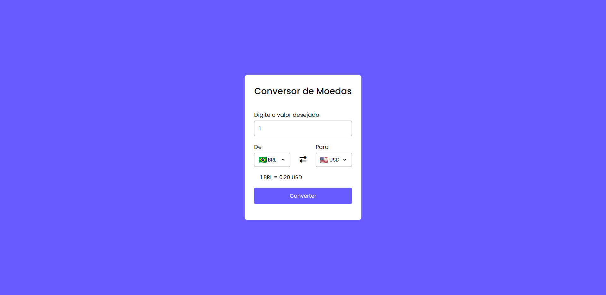

<h1 align="center"> Conversor de moedas </h1>

Conversor de moedas é um projeto desenvolvido com HTML, CSS e JavaScript, com base nos ensinamentos do vídeo [Build A Currency Converter App in HTML CSS & JavaScript](https://youtu.be/UY7F37KHyI8) do canal [@CodingNepal](https://www.youtube.com/@CodingNepal) no Youtube. 

 

  <a href="#-tecnologias">🚀 Tecnologias</a>&nbsp;&nbsp;&nbsp;|&nbsp;&nbsp;&nbsp;
  <a href="#-projeto">💻 Projeto</a>&nbsp;&nbsp;&nbsp;|&nbsp;&nbsp;&nbsp;
  <a href="#-layout">🔖 Layout</a>&nbsp;&nbsp;&nbsp;|&nbsp;&nbsp;&nbsp;
  <a href="#memo-licença">:memo: Licença</a>

 

  

 

## 🚀 Tecnologias

Esse projeto foi desenvolvido com as seguintes tecnologias:

 

## 💻 Projeto

O projeto permite que o usuário possa converter valores monetários de diversos países. Este projeto foi desenvolvido com a API do [Exchange Rate API](https://www.exchangerate-api.com/).

 

## 🔖 Layout

Você pode navegar pelo projeto através [DESSE LINK](https://thiagomonts.github.io/currency-converter/).

 

## :memo: Licença

Esse projeto está sob a licença MIT.

 

---

Desenvolvido por [Thiago Honorato](https://www.linkedin.com/in/honoratothiago/)
